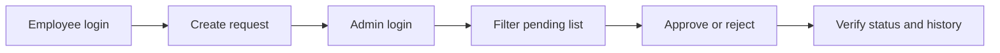

# UI/UX Polish Batch

> **Execution mode:** Inline batch execution only. Execute one small batch at a time, verify, then continue. Do not use parallel/asynchronous implementation subagents for this project.

**Goal:** Bring the implemented app closer to the stated project requirement: a clean Equipment Purchase Request prototype whose deep-dive is UI/UX and front-end development. Stay conservative: no schema changes, no new product features, no new dependencies unless a compile issue forces it.

**Reference spec:** `docs/superpowers/specs/2026-05-20-equipment-purchase-request-design.md`

## Skills Applied

- `epr-senior-orchestrator`: keep the work as one small verified batch and aligned with `docs/project-status.md`.
- `epr-request-ui`: focus on `/login`, `/requests`, `/requests/new`, `/requests/[id]`, status clarity, loading/error states, and semantic markup.
- `frontend-skill`: restrained product UI — calm hierarchy, utility copy, clear actions, few colors, no decorative complexity.

**Visual thesis:** an internal operations workspace that feels calm, precise, and easy to scan.

**Content plan:** authenticate, view request workload, create one request, inspect details/history, make an admin decision.

**Interaction thesis:** make primary actions obvious, make status changes unmistakable, and keep validation/errors close to the field that needs attention.

## Planned Changes

### 1. Japanese-first workflow copy and status clarity

- Update `app/(auth)/login/page.tsx`, `app/(app)/layout.tsx`, `components/create-request-form.tsx`, `components/approval-panel.tsx`, and `app/(app)/requests/[id]/page.tsx` so labels match the Japanese README and seeded category data.
- Update `components/request-status-badge.tsx` to show reviewer-friendly labels: `申請中`, `承認済み`, `却下`, while preserving enum values in code.

### 2. Improve the admin list without changing authorization

- Extend `lib/repositories/requests.repo.ts` with an optional `status` filter for `pending` / `approved` / `rejected`, using the existing `purchase_requests(status, requested_at)` index.
- Add a small profile lookup helper in `lib/repositories/profiles.repo.ts` for admin applicant names, rather than changing the database schema.
- Update `app/(app)/requests/page.tsx` to read `searchParams`, identify the current role, apply the status filter only when valid, and pass applicant display data to the list.
- Update `components/request-list.tsx` with clearer empty states, an admin-only applicant column, and status filter controls that remain simple and accessible.

### 3. Refine detail and approval UX

- Update `app/(app)/requests/[id]/page.tsx` to show applicant, category, amount, requested/decided dates, status, and history with consistent Japanese labels.
- Keep `components/approval-panel.tsx` small and client-only. Improve the layout so approval and rejection are clearly separated, rejection note guidance is explicit, and pending/submitting states are obvious.
- Update `app/(app)/requests/_actions.ts` only as needed for cleaner Japanese error messages and a fresh redirect/revalidation after admin decisions.

### 4. Keep route states and docs honest

- Review `app/(app)/requests/loading.tsx`, `app/(app)/requests/[id]/loading.tsx`, and `app/(app)/error.tsx` for copy consistency only; no heavy redesign.
- Update `docs/project-status.md` with a concise batch log entry after implementation and verification.
- Do not touch `.env.local`, Supabase secrets, migrations, or unrelated dirty documentation unless directly needed for this UI batch.

## Verification

Run, in order:

```bash
pnpm lint
pnpm typecheck
pnpm test
pnpm build
```

If the local Supabase credentials remain valid, also do a manual browser walkthrough:



## Scope Guardrails

- No new database tables, migrations, notification systems, attachments, CI, Playwright, or multi-step approval.
- No broad refactor of auth, RLS, or Supabase setup.
- Commit after the batch is verified on the machine doing the implementation.

## Task Checklist

- [ ] Japanese-first labels, status badges, and route copy across login, shell, list, form, detail, and errors.
- [ ] Status filtering and applicant visibility for the admin request list using existing repository patterns.
- [ ] Refine approval/rejection panel and decision feedback while keeping it a small client component.
- [ ] Run lint/typecheck/test/build and update project status with factual results.
